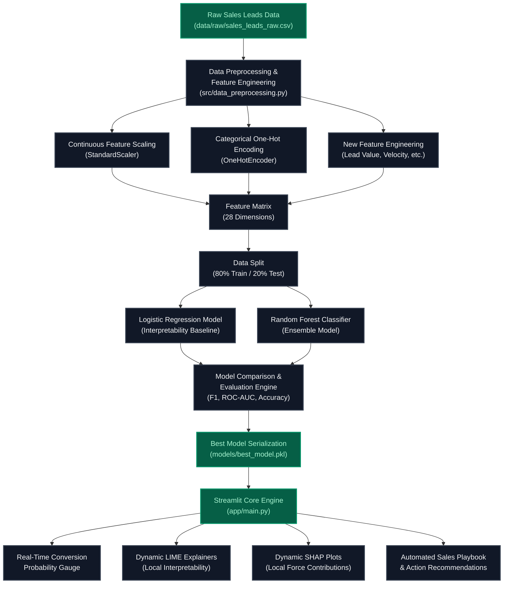

# System Architecture & Data Workflow Diagram

This document illustrates the technical architecture and data processing lifecycle for the **AI-Based Sales Conversion Probability Prediction** system.

---

## 1. High-Level Technical Architecture

The system is designed following a modular, pipeline-centric architecture to ensure separation of concerns, scalability, and ease of deployment.

---

## 2. Step-by-Step Data Lifecycle

### Step 1: Ingestion & Synthesis
* **Trigger:** Execution of `src/data_generator.py`.
* **Action:** Synthesizes 5,000 lead records.
* **Correlations:** Establishes non-linear relations (e.g., referral source + low response time + high engagement = higher probability) to give machine learning models a realistic mathematical signal.

### Step 2: Processing & Fitting
* **Trigger:** Execution of `src/data_preprocessing.py`.
* **Cleaning:** Scans for missing values (imputed using column medians/modes) and drops duplicates.
* **Feature Engineering:** Computes four high-level business indicators (Lead Value Score, Interaction Velocity, Engagement Per Interaction, High Intent Lead).
* **Fitting:** Transforms continuous variables via standardization (`StandardScaler`) and categorical features via one-hot encoding (`OneHotEncoder`). The pipelines are serialized to `models/preprocessor.pkl`.

### Step 3: Training, Validation & Saving
* **Trigger:** Execution of `src/model_training.py`.
* **Action:** Split processed data into training (80%) and testing (20%) datasets.
* **Training:** Trains both Logistic Regression and Random Forest models concurrently.
* **Evaluation:** Scores both models across five major performance metrics (Accuracy, Precision, Recall, F1-Score, ROC-AUC) and outputs Confusion Matrices and ROC curves.
* **Auto-Selection:** Selects the model with the highest F1-Score, saves it as `models/best_model.pkl`, and writes performance assets to `reports/images/`.

### Step 4: Front-End Dashboard & Explainable AI
* **Trigger:** Web execution via `streamlit run app/main.py`.
* **Inference Engine:** Loads the preprocessor and selected best model. Transforms manual inputs or selected demo lead presets.
* **Live Probability Scoring:** Runs the prediction to calculate a real-time decimal probability (0.0 to 1.0) and assigns the lead a priority (High, Medium, or Low).
* **Dual Explainability (XAI):**
  * **LIME Tabular Explainer:** Generates a local surrogate model around the input to visually display supporting/opposing parameters.
  * **SHAP Explainer:** Computes local feature impact values and draws an interactive horizontal contribution plot.
